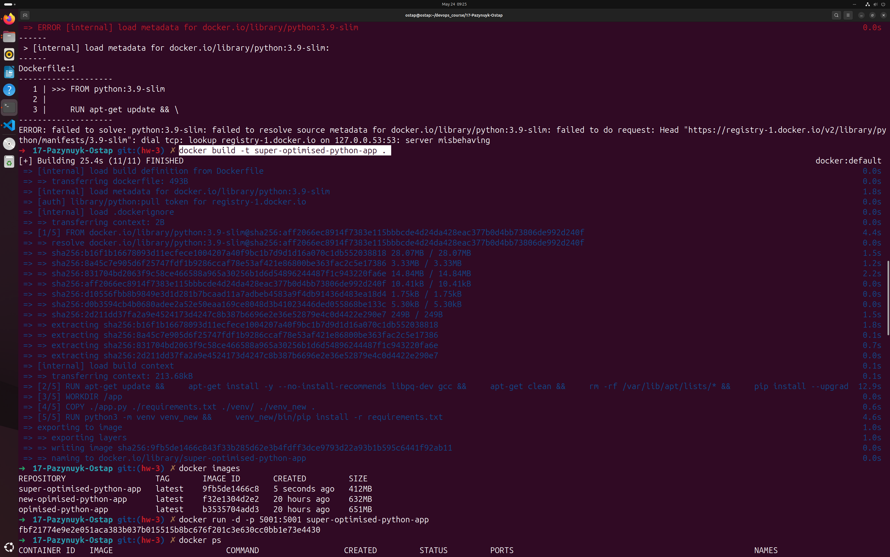
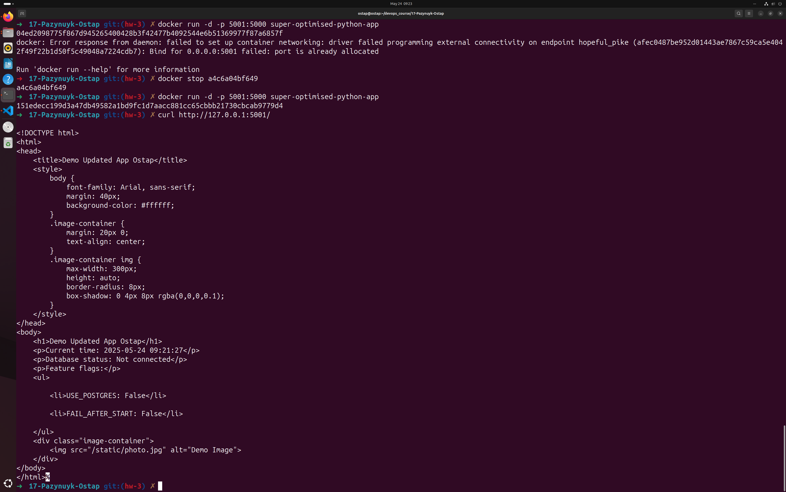

1. **Скопіювати Dockerfile**
2. **Cкопіюйте Dockerfile для створення образу з демо-сервісом у власний проект.
Створити та запустити контейнер**

```aiignore
  ~ cd devops_course 
➜  devops_course cd 17-Pazynuyk-Ostap 
➜  17-Pazynuyk-Ostap git:(main) ✗ ls -la
total 48
drwxrwxr-x 8 ostap ostap 4096 May 10 10:37 .
drwxrwxr-x 4 ostap ostap 4096 May  2 15:26 ..
-rw-rw-r-- 1 ostap ostap 3077 May 10 10:44 app.py
-rw-rw-r-- 1 ostap ostap  266 May 10 10:19 Dockerfile
drwxrwxr-x 7 ostap ostap 4096 May 10 10:17 .git
drwxrwxr-x 2 ostap ostap 4096 May  2 15:27 hw-1
drwxrwxr-x 2 ostap ostap 4096 May 10 10:12 HW1
drwxrwxr-x 2 ostap ostap 4096 May 10 10:12 HW2
drwxrwxr-x 2 ostap ostap 4096 May 10 10:12 .idea
-rw-rw-r-- 1 ostap ostap   19 May 10 10:12 README.md
-rw-rw-r-- 1 ostap ostap   37 May 10 10:18 requirements.txt
drwxrwxr-x 5 ostap ostap 4096 May 10 10:37 venv
➜  17-Pazynuyk-Ostap git:(main) ✗ cp -r ../DOCKER-AND-KUBERNETES_MARTYNIUK_1 /
cp: cannot create directory '/DOCKER-AND-KUBERNETES_MARTYNIUK_1': Permission denied
➜  17-Pazynuyk-Ostap git:(main) ✗ cp -r ../DOCKER-AND-KUBERNETES_MARTYNIUK_1/venv_new / 
cp: cannot create directory '/venv_new': Permission denied
➜  17-Pazynuyk-Ostap git:(main) ✗ cp -r ../DOCKER-AND-KUBERNETES_MARTYNIUK_1/venv_new ../17-Pazynuyk-Ostap 
➜  17-Pazynuyk-Ostap git:(main) ✗ ls -la
total 52
drwxrwxr-x 9 ostap ostap 4096 May 11 07:56 .
drwxrwxr-x 4 ostap ostap 4096 May  2 15:26 ..
-rw-rw-r-- 1 ostap ostap 3077 May 10 10:44 app.py
-rw-rw-r-- 1 ostap ostap  266 May 10 10:19 Dockerfile
drwxrwxr-x 7 ostap ostap 4096 May 10 10:17 .git
drwxrwxr-x 2 ostap ostap 4096 May  2 15:27 hw-1
drwxrwxr-x 2 ostap ostap 4096 May 10 10:12 HW1
drwxrwxr-x 2 ostap ostap 4096 May 10 10:12 HW2
drwxrwxr-x 2 ostap ostap 4096 May 10 10:12 .idea
-rw-rw-r-- 1 ostap ostap   19 May 10 10:12 README.md
-rw-rw-r-- 1 ostap ostap   37 May 10 10:18 requirements.txt
drwxrwxr-x 5 ostap ostap 4096 May 10 10:37 venv
drwxrwxr-x 6 ostap ostap 4096 May 11 07:56 venv_new
➜  17-Pazynuyk-Ostap git:(main) ✗ docker ps
CONTAINER ID   IMAGE     COMMAND   CREATED   STATUS    PORTS     NAMES
➜  17-Pazynuyk-Ostap git:(main) ✗ docker images
REPOSITORY         TAG       IMAGE ID       CREATED        SIZE
python-app-image   latest    2f99c58e6062   21 hours ago   639MB
hello-world        latest    f1f77a0f96b7   3 months ago   5.2kB
➜  17-Pazynuyk-Ostap git:(main) ✗ docker ps -a 
CONTAINER ID   IMAGE              COMMAND                  CREATED        STATUS                        PORTS                                         NAMES
69d1f6e13a17   python-app-image   "venv/bin/python3 ap…"   21 hours ago   Exited (255) 24 minutes ago   0.0.0.0:5000->5000/tcp, [::]:5000->5000/tcp   sharp_banach
ad011ef974b9   python-app-image   "venv/bin/python3 ap…"   21 hours ago   Exited (0) 21 hours ago                                                     hopeful_wing
54856e0d7a9b   python-app-image   "venv/bin/python3 ap…"   21 hours ago   Exited (0) 21 hours ago                                                     focused_meitner
➜  17-Pazynuyk-Ostap git:(main) ✗ docker container prune
WARNING! This will remove all stopped containers.
Are you sure you want to continue? [y/N] y
Deleted Containers:
69d1f6e13a1715c087b4426b8e9e86ec48153f6bc7545b704f95466ce8fa1680
ad011ef974b9069bb460c213985834aa3f753f4010187e6b7e97fbd9b642d440
54856e0d7a9b51263ee503707727c4eef8a7187bae9108cf09d5f9735b34f354

Total reclaimed space: 0B
➜  17-Pazynuyk-Ostap git:(main) ✗ docker run -d -p 5000:5000 python-app-image 
1813d03a3aca7f706bc87925c0681a1527d3f16c8666b3ddc6fc4af8e79d4
```

3. **Внесіть зміни в код та оновіть залежності**


```aiignore
➜  17-Pazynuyk-Ostap git:(main) ✗ pip install --upgrade Flask
error: externally-managed-environment

× This environment is externally managed
╰─> To install Python packages system-wide, try apt install
    python3-xyz, where xyz is the package you are trying to
    install.
    
    If you wish to install a non-Debian-packaged Python package,
    create a virtual environment using python3 -m venv path/to/venv.
    Then use path/to/venv/bin/python and path/to/venv/bin/pip. Make
    sure you have python3-full installed.
    
    If you wish to install a non-Debian packaged Python application,
    it may be easiest to use pipx install xyz, which will manage a
    virtual environment for you. Make sure you have pipx installed.
    
    See /usr/share/doc/python3.13/README.venv for more information.

note: If you believe this is a mistake, please contact your Python installation or OS distribution provider. You can override this, at the risk of breaking your Python installation or OS, by passing --break-system-packages.
hint: See PEP 668 for the detailed specification.
➜  17-Pazynuyk-Ostap git:(main) ✗ ls -la
total 52
drwxrwxr-x 9 ostap ostap 4096 May 11 07:56 .
drwxrwxr-x 4 ostap ostap 4096 May  2 15:26 ..
-rw-rw-r-- 1 ostap ostap 3077 May 10 10:44 app.py
-rw-rw-r-- 1 ostap ostap  266 May 10 10:19 Dockerfile
drwxrwxr-x 7 ostap ostap 4096 May 10 10:17 .git
drwxrwxr-x 2 ostap ostap 4096 May  2 15:27 hw-1
drwxrwxr-x 2 ostap ostap 4096 May 10 10:12 HW1
drwxrwxr-x 2 ostap ostap 4096 May 10 10:12 HW2
drwxrwxr-x 2 ostap ostap 4096 May 10 10:12 .idea
-rw-rw-r-- 1 ostap ostap   19 May 10 10:12 README.md
-rw-rw-r-- 1 ostap ostap   37 May 10 10:18 requirements.txt
drwxrwxr-x 5 ostap ostap 4096 May 10 10:37 venv
drwxrwxr-x 6 ostap ostap 4096 May 11 07:56 venv_new
➜  17-Pazynuyk-Ostap git:(main) ✗ source venv_new/bin/activate
(venv_new) ➜  17-Pazynuyk-Ostap git:(main) ✗ pip install --upgrade Flask
Collecting Flask
  Downloading flask-3.1.0-py3-none-any.whl.metadata (2.7 kB)
Collecting Werkzeug>=3.1 (from Flask)
  Using cached werkzeug-3.1.3-py3-none-any.whl.metadata (3.7 kB)
Collecting Jinja2>=3.1.2 (from Flask)
  Using cached jinja2-3.1.6-py3-none-any.whl.metadata (2.9 kB)
Collecting itsdangerous>=2.2 (from Flask)
  Using cached itsdangerous-2.2.0-py3-none-any.whl.metadata (1.9 kB)
Collecting click>=8.1.3 (from Flask)
  Downloading click-8.2.0-py3-none-any.whl.metadata (2.5 kB)
Collecting blinker>=1.9 (from Flask)
  Using cached blinker-1.9.0-py3-none-any.whl.metadata (1.6 kB)
Collecting MarkupSafe>=2.0 (from Jinja2>=3.1.2->Flask)
  Using cached MarkupSafe-3.0.2-cp313-cp313-manylinux_2_17_aarch64.manylinux2014_aarch64.whl.metadata (4.0 kB)
Downloading flask-3.1.0-py3-none-any.whl (102 kB)
Using cached blinker-1.9.0-py3-none-any.whl (8.5 kB)
Downloading click-8.2.0-py3-none-any.whl (102 kB)
Using cached itsdangerous-2.2.0-py3-none-any.whl (16 kB)
Using cached jinja2-3.1.6-py3-none-any.whl (134 kB)
Using cached werkzeug-3.1.3-py3-none-any.whl (224 kB)
Using cached MarkupSafe-3.0.2-cp313-cp313-manylinux_2_17_aarch64.manylinux2014_aarch64.whl (24 kB)
Installing collected packages: MarkupSafe, itsdangerous, click, blinker, Werkzeug, Jinja2, Flask
Successfully installed Flask-3.1.0 Jinja2-3.1.6 MarkupSafe-3.0.2 Werkzeug-3.1.3 blinker-1.9.0 click-8.2.0 itsdangerous-2.2.0
(venv_new) ➜  17-Pazynuyk-Ostap git:(main) ✗ pip install --upgrade psycopg2-binary
Collecting psycopg2-binary
  Using cached psycopg2_binary-2.9.10-cp313-cp313-manylinux_2_17_aarch64.manylinux2014_aarch64.whl.metadata (4.9 kB)
Using cached psycopg2_binary-2.9.10-cp313-cp313-manylinux_2_17_aarch64.manylinux2014_aarch64.whl (2.9 MB)
Installing collected packages: psycopg2-binary
Successfully installed psycopg2-binary-2.9.10
(venv_new) ➜  17-Pazynuyk-Ostap git:(main) ✗ docker images                        
REPOSITORY         TAG       IMAGE ID       CREATED        SIZE
python-app-image   latest    2f99c58e6062   22 hours ago   639MB
hello-world        latest    f1f77a0f96b7   3 months ago   5.2kB
(venv_new) ➜  17-Pazynuyk-Ostap git:(main) ✗ docker build --no-cache -t python-app-image
ERROR: docker: 'docker buildx build' requires 1 argument

Usage:  docker buildx build [OPTIONS] PATH | URL | -

Run 'docker buildx build --help' for more information
(venv_new) ➜  17-Pazynuyk-Ostap git:(main) ✗ docker build --no-cache -t python-app-image .
[+] Building 40.1s (13/13) FINISHED                                                                                                              docker:default
 => [internal] load build definition from Dockerfile                                                                                                       0.0s
 => => transferring dockerfile: 305B                                                                                                                       0.0s
 => [internal] load metadata for docker.io/library/ubuntu:24.04                                                                                            1.0s
 => [internal] load .dockerignore                                                                                                                          0.0s
 => => transferring context: 2B                                                                                                                            0.0s
 => CACHED [1/8] FROM docker.io/library/ubuntu:24.04@sha256:6015f66923d7afbc53558d7ccffd325d43b4e249f41a6e93eef074c9505d2233                               0.0s
 => [internal] load build context                                                                                                                          0.4s
 => => transferring context: 11.09MB                                                                                                                       0.3s
 => [2/8] RUN apt-get update                                                                                                                               6.9s
 => [3/8] RUN apt-get install -y python3 python3-pip python3-venv libpq-dev                                                                               18.5s 
 => [4/8] RUN apt-get clean                                                                                                                                0.3s 
 => [5/8] WORKDIR /app                                                                                                                                     0.0s 
 => [6/8] COPY . .                                                                                                                                         0.5s 
 => [7/8] RUN python3 -m venv venv                                                                                                                         2.0s 
 => [8/8] RUN venv/bin/pip install -r requirements.txt                                                                                                     8.9s 
 => exporting to image                                                                                                                                     1.9s 
 => => exporting layers                                                                                                                                    1.9s 
 => => writing image sha256:40678f86c80b41f44f0ec1681f5f79e48cce45ca20f8b5cb19706daf68a07a75                                                               0.0s 
 => => naming to docker.io/library/python-app-image                                                                                                        0.0s 
(venv_new) ➜  17-Pazynuyk-Ostap git:(main) ✗ docker run -d -p 5000:5000 python-app-image                             
0c4c41f360dc09a7a86eaf8b768cfdef01c84adc2c01cd58f45eebdc5f25b4e6
docker: Error response from daemon: failed to set up container networking: driver failed programming external connectivity on endpoint nice_ramanujan (9d2796bff33933bde29bcc7b9bd9c543629659be96c4c055a22eb7ab6ad5844b): Bind for 0.0.0.0:5000 failed: port is already allocated

Run 'docker run --help' for more information
(venv_new) ➜  17-Pazynuyk-Ostap git:(main) ✗ docker run -d -p 6000:5000 python-app-image 
395925c3b44dd8a89b6f9e91723b4ec13498375048c4aff6b1541395a76021b9
(venv_new) ➜  17-Pazynuyk-Ostap git:(main) ✗  
(venv_new) ➜  17-Pazynuyk-Ostap git:(main) ✗ deactivate
➜  17-Pazynuyk-Ostap git:(main) ✗ docker run -d -p 6000:5000 python-app-image 
cc90b8c2ed0599ffdc4f9f7318a790dd4ddae6c408e82d6021476a64127bcb23
docker: Error response from daemon: failed to set up container networking: driver failed programming external connectivity on endpoint pensive_dirac (faddb5d0d6c8dba3ecb6b7d18ac2cd4bcea65cd15b45a94a18a7991393b2d363): Bind for 0.0.0.0:6000 failed: port is already allocated

Run 'docker run --help' for more information
➜  17-Pazynuyk-Ostap git:(main) ✗ docker ps
CONTAINER ID   IMAGE              COMMAND                  CREATED              STATUS              PORTS                                         NAMES
395925c3b44d   python-app-image   "venv/bin/python3 ap…"   About a minute ago   Up About a minute   0.0.0.0:6000->5000/tcp, [::]:6000->5000/tcp   fervent_lederberg
1813d03a3aca   2f99c58e6062       "venv/bin/python3 ap…"   17 minutes ago       Up 17 minutes       0.0.0.0:5000->5000/tcp, [::]:5000->5000/tcp   hopeful_darwin
➜  17-Pazynuyk-Ostap git:(main) ✗ docker logs 395925c3b44d
 * Serving Flask app 'app'
 * Debug mode: off
WARNING: This is a development server. Do not use it in a production deployment. Use a production WSGI server instead.
 * Running on all addresses (0.0.0.0)
 * Running on http://127.0.0.1:5000
 * Running on http://172.17.0.3:5000
Press CTRL+C to quit
➜  17-Pazynuyk-Ostap git:(main) ✗ docker stop 395925c3b44d                    
395925c3b44d
➜  17-Pazynuyk-Ostap git:(main) ✗ docker stop 1813d03a3aca
1813d03a3aca
➜  17-Pazynuyk-Ostap git:(main) ✗ docker container prune                       
WARNING! This will remove all stopped containers.
Are you sure you want to continue? [y/N] y
Deleted Containers:
cc90b8c2ed0599ffdc4f9f7318a790dd4ddae6c408e82d6021476a64127bcb23
395925c3b44dd8a89b6f9e91723b4ec13498375048c4aff6b1541395a76021b9
0c4c41f360dc09a7a86eaf8b768cfdef01c84adc2c01cd58f45eebdc5f25b4e6
1813d03a3aca7f706bc87925c0681a1527d3f16c8666b3ddc6fc4af8e79d4d88

Total reclaimed space: 0B
➜  17-Pazynuyk-Ostap git:(main) ✗ docker run -d -p 5000:5000 python-app-image 
7fca0eb85e86058ad34cc7f6ea05414938e9bfb2e1a075c228e70e57dde73879
```
4. **Запустити два сервіси різних версій одночасно**


```aiignore
➜  17-Pazynuyk-Ostap git:(main) ✗ docker build --no-cache -t old-python-app .  
[+] Building 41.3s (13/13) FINISHED                                                                                                              docker:default
 => [internal] load build definition from Dockerfile                                                                                                       0.0s
 => => transferring dockerfile: 305B                                                                                                                       0.0s
 => [internal] load metadata for docker.io/library/ubuntu:24.04                                                                                            0.9s
 => [internal] load .dockerignore                                                                                                                          0.0s
 => => transferring context: 2B                                                                                                                            0.0s
 => CACHED [1/8] FROM docker.io/library/ubuntu:24.04@sha256:6015f66923d7afbc53558d7ccffd325d43b4e249f41a6e93eef074c9505d2233                               0.0s
 => [internal] load build context                                                                                                                          0.1s
 => => transferring context: 222.86kB                                                                                                                      0.1s
 => [2/8] RUN apt-get update                                                                                                                               4.5s
 => [3/8] RUN apt-get install -y python3 python3-pip python3-venv libpq-dev                                                                               21.8s
 => [4/8] RUN apt-get clean                                                                                                                                0.2s 
 => [5/8] WORKDIR /app                                                                                                                                     0.0s 
 => [6/8] COPY . .                                                                                                                                         0.6s 
 => [7/8] RUN python3 -m venv venv                                                                                                                         2.1s 
 => [8/8] RUN venv/bin/pip install -r requirements.txt                                                                                                     8.7s 
 => exporting to image                                                                                                                                     2.4s 
 => => exporting layers                                                                                                                                    2.4s 
 => => writing image sha256:1f40af2c615768184a7ce61163e02222a64d56e98c4231454c41cedfb2e1fd3f                                                               0.0s 
 => => naming to docker.io/library/old-python-app                                                                                                          0.0s 
➜  17-Pazynuyk-Ostap git:(main) ✗ docker run -d -p 5001:5000 old-python-app   
4c80cb67cac847cd7c5ceb53ba4d6a81d5515ee316f5dbc62c4a82491b8f4b6f
➜  17-Pazynuyk-Ostap git:(main) ✗ docker ps
CONTAINER ID   IMAGE              COMMAND                  CREATED         STATUS         PORTS                                         NAMES
4c80cb67cac8   old-python-app     "venv/bin/python3 ap…"   4 seconds ago   Up 3 seconds   0.0.0.0:5001->5000/tcp, [::]:5001->5000/tcp   agitated_cori
7fca0eb85e86   python-app-image   "venv/bin/python3 ap…"   8 minutes ago   Up 8 minutes   0.0.0.0:5000->5000/tcp, [::]:5000->5000/tcp   practical_margulis
➜  17-Pazynuyk-Ostap git:(main) ✗ docker stop python-app-image 
Error response from daemon: No such container: python-app-image
➜  17-Pazynuyk-Ostap git:(main) ✗ docker stop 7fca0eb85e86
7fca0eb85e86
➜  17-Pazynuyk-Ostap git:(main) ✗ docker container prune                      
WARNING! This will remove all stopped containers.
Are you sure you want to continue? [y/N] y
Deleted Containers:
7fca0eb85e86058ad34cc7f6ea05414938e9bfb2e1a075c228e70e57dde73879

Total reclaimed space: 0B
➜  17-Pazynuyk-Ostap git:(main) ✗ docker build -t new-python-app . 
[+] Building 3.8s (12/12) FINISHED                                                                                                               docker:default
 => [internal] load build definition from Dockerfile                                                                                                       0.0s
 => => transferring dockerfile: 313B                                                                                                                       0.0s
 => [internal] load metadata for docker.io/library/ubuntu:24.04                                                                                            0.9s
 => [internal] load .dockerignore                                                                                                                          0.0s
 => => transferring context: 2B                                                                                                                            0.0s
 => [1/8] FROM docker.io/library/ubuntu:24.04@sha256:6015f66923d7afbc53558d7ccffd325d43b4e249f41a6e93eef074c9505d2233                                      0.0s
 => [internal] load build context                                                                                                                          0.1s
 => => transferring context: 223.13kB                                                                                                                      0.1s
 => CACHED [2/8] RUN apt-get update                                                                                                                        0.0s
 => CACHED [3/8] RUN apt-get install -y python3 python3-pip python3-venv libpq-dev                                                                         0.0s
 => CACHED [4/8] RUN apt-get clean                                                                                                                         0.0s
 => CACHED [5/8] WORKDIR /app                                                                                                                              0.0s
 => [6/8] COPY . .                                                                                                                                         0.4s
 => [7/8] RUN python3 -m venv venv_new                                                                                                                     2.2s
 => ERROR [8/8] RUN venv/bin/pip install -r requirements.txt                                                                                               0.1s
------
 > [8/8] RUN venv/bin/pip install -r requirements.txt:
0.079 /bin/sh: 1: venv/bin/pip: not found
------
Dockerfile:12
--------------------
  10 |     
  11 |     RUN python3 -m venv venv_new
  12 | >>> RUN venv/bin/pip install -r requirements.txt
  13 |     
  14 |     EXPOSE 5000
--------------------
ERROR: failed to solve: process "/bin/sh -c venv/bin/pip install -r requirements.txt" did not complete successfully: exit code: 127
➜  17-Pazynuyk-Ostap git:(main) ✗ docker build -t new-python-app .
[+] Building 12.5s (13/13) FINISHED                                                                                                              docker:default
 => [internal] load build definition from Dockerfile                                                                                                       0.0s
 => => transferring dockerfile: 317B                                                                                                                       0.0s
 => [internal] load metadata for docker.io/library/ubuntu:24.04                                                                                            0.4s
 => [internal] load .dockerignore                                                                                                                          0.0s
 => => transferring context: 2B                                                                                                                            0.0s
 => [1/8] FROM docker.io/library/ubuntu:24.04@sha256:6015f66923d7afbc53558d7ccffd325d43b4e249f41a6e93eef074c9505d2233                                      0.0s
 => [internal] load build context                                                                                                                          0.1s
 => => transferring context: 220.04kB                                                                                                                      0.1s
 => CACHED [2/8] RUN apt-get update                                                                                                                        0.0s
 => CACHED [3/8] RUN apt-get install -y python3 python3-pip python3-venv libpq-dev                                                                         0.0s
 => CACHED [4/8] RUN apt-get clean                                                                                                                         0.0s
 => CACHED [5/8] WORKDIR /app                                                                                                                              0.0s
 => [6/8] COPY . .                                                                                                                                         0.4s
 => [7/8] RUN python3 -m venv venv_new                                                                                                                     2.2s
 => [8/8] RUN venv_new/bin/pip install -r requirements.txt                                                                                                 9.1s
 => exporting to image                                                                                                                                     0.3s 
 => => exporting layers                                                                                                                                    0.3s 
 => => writing image sha256:c395dee28e8bb682f655ade0bbd8dd45c351b0ddea3e0bd5bec7c54e71ee519d                                                               0.0s 
 => => naming to docker.io/library/new-python-app                                                                                                          0.0s 
➜  17-Pazynuyk-Ostap git:(main) ✗ docker ps                                
CONTAINER ID   IMAGE            COMMAND                  CREATED         STATUS         PORTS                                         NAMES
4c80cb67cac8   old-python-app   "venv/bin/python3 ap…"   9 minutes ago   Up 9 minutes   0.0.0.0:5001->5000/tcp, [::]:5001->5000/tcp   agitated_cori
➜  17-Pazynuyk-Ostap git:(main) ✗ docker run -d -p 5000:5000 new-python-app
d501ea83b9331f172f53984c0c48f7854372d4a7dd48b162b8482be8ecfe6565
➜  17-Pazynuyk-Ostap git:(main) ✗ docker ps
CONTAINER ID   IMAGE            COMMAND                  CREATED         STATUS         PORTS                                         NAMES
d501ea83b933   new-python-app   "venv_new/bin/python…"   3 seconds ago   Up 3 seconds   0.0.0.0:5000->5000/tcp, [::]:5000->5000/tcp   lucid_varahamihira
4c80cb67cac8   old-python-app   "venv/bin/python3 ap…"   9 minutes ago   Up 9 minutes   0.0.0.0:5001->5000/tcp, [::]:5001->5000/tcp   agitated_cori
```
5. **Порівняйте підходи.**

В докері значно зручніше мігрувати та порівнювати версії, опираючись на образи, оскільки вони "запамятовують" стан проєкту в конктретний проміжок часу, що дозволяє значно зручніше почуватись при оновленні залежностей та порівнянні підходів.
Оскільки для мене підхід virtual env був новий, я мусив дрдатково виділити час на те щоб зрозуміти цей підхід, тому мені на підхід з та без докера пішла приблизно однакова кількість часу.

6. **Оптимізувати Dockerfile.**
7. **Створити та завантажити оптимізований образ**.

Я згрупував виконання команд RUN, щоб зменшити кількість додаткових шарів при створенні образу.

Також намагався оптимізувати кільість файлів, які необхідні для запуску контейнера, однак виявилось, 
що файли які я намагався "оминути" теж необхідні, тому зупинився на підході копіювання всіх файлів директорів в образ.

Як наслідок, вдалось оптимізувати побудову образу з 8 шарів до 5. 

Час побудови образу зменшився з 35 секунд до 12 секунд.

https://hub.docker.com/repository/docker/opazyniuk/python-app/general

```aiignore
➜  17-Pazynuyk-Ostap git:(main) ✗ docker build -t opimised-python-app . 
[+] Building 35.5s (10/10) FINISHED                                                                                                              docker:default
 => [internal] load build definition from Dockerfile                                                                                                       0.0s
 => => transferring dockerfile: 348B                                                                                                                       0.0s
 => [internal] load metadata for docker.io/library/ubuntu:24.04                                                                                            0.9s
 => [internal] load .dockerignore                                                                                                                          0.0s
 => => transferring context: 2B                                                                                                                            0.0s
 => CACHED [1/5] FROM docker.io/library/ubuntu:24.04@sha256:6015f66923d7afbc53558d7ccffd325d43b4e249f41a6e93eef074c9505d2233                               0.0s
 => [internal] load build context                                                                                                                          0.1s
 => => transferring context: 37B                                                                                                                           0.1s
 => [2/5] RUN apt-get update &&     apt-get install -y python3 python3-pip python3-venv libpq-dev &&     apt-get clean                                    22.1s
 => [3/5] WORKDIR /app                                                                                                                                     0.0s 
 => [4/5] COPY requirements.txt .                                                                                                                          0.0s 
 => [5/5] RUN python3 -m venv venv_new &&     venv_new/bin/pip install -r requirements.txt                                                                10.3s 
 => exporting to image                                                                                                                                     1.9s 
 => => exporting layers                                                                                                                                    1.9s 
 => => writing image sha256:32af0ad6780b5f23cdbbf84e08ae9b8e9c7ba1f958c5e1b93c9f604dfaeed932                                                               0.0s 
 => => naming to docker.io/library/opimised-python-app                                                                                                     0.0s 
➜  17-Pazynuyk-Ostap git:(main) ✗ docker run -d -p 5002:5000 opimised-python-app
055dc7dd972d323da77fb0aaa1032a0fe9f43c09261c6da804fdc3750bb3cba0
➜  17-Pazynuyk-Ostap git:(main) ✗ docker logs 055dc7dd972d323da77fb0aaa1032a0fe9f43c09261c6da804fdc3750bb3cba0
venv_new/bin/python3: can't open file '/app/app.py': [Errno 2] No such file or directory
➜  17-Pazynuyk-Ostap git:(main) ✗ docker build -t opimised-python-app .                            
[+] Building 12.6s (10/10) FINISHED                                                                                                              docker:default
 => [internal] load build definition from Dockerfile                                                                                                       0.0s
 => => transferring dockerfile: 333B                                                                                                                       0.0s
 => [internal] load metadata for docker.io/library/ubuntu:24.04                                                                                            0.5s
 => [internal] load .dockerignore                                                                                                                          0.0s
 => => transferring context: 2B                                                                                                                            0.0s
 => [1/5] FROM docker.io/library/ubuntu:24.04@sha256:6015f66923d7afbc53558d7ccffd325d43b4e249f41a6e93eef074c9505d2233                                      0.0s
 => [internal] load build context                                                                                                                          0.6s
 => => transferring context: 52.43MB                                                                                                                       0.6s
 => CACHED [2/5] RUN apt-get update &&     apt-get install -y python3 python3-pip python3-venv libpq-dev &&     apt-get clean                              0.0s
 => CACHED [3/5] WORKDIR /app                                                                                                                              0.0s
 => [4/5] COPY . .                                                                                                                                         0.4s
 => [5/5] RUN python3 -m venv venv_new &&     venv_new/bin/pip install -r requirements.txt                                                                10.8s
 => exporting to image                                                                                                                                     0.3s 
 => => exporting layers                                                                                                                                    0.2s 
 => => writing image sha256:78d1e149d7fbeb8d27b94756866b4ade9187a7f5173a3f71314c2ce7960754b6                                                               0.0s 
 => => naming to docker.io/library/opimised-python-app                                                                                                     0.0s 
➜  17-Pazynuyk-Ostap git:(main) ✗ docker run -d -p 5002:5000 opimised-python-app                              
1ba19b8c4354834007b9fda75ab6376891f3b5706a56a9f5abe543760c5e57f5
➜  17-Pazynuyk-Ostap git:(main) ✗ docker logs 1ba19b8c4354834007b9fda75ab6376891f3b5706a56a9f5abe543760c5e57f5
 * Serving Flask app 'app'
 * Debug mode: off
WARNING: This is a development server. Do not use it in a production deployment. Use a production WSGI server instead.
 * Running on all addresses (0.0.0.0)
 * Running on http://127.0.0.1:5000
 * Running on http://172.17.0.4:5000
Press CTRL+C to quit

```

7.1 Доповнення до ДЗ.
- Чітко вказав, які саме файли необхідно скопіювати з системи для створення відповідного образу.
`COPY ./app.py ./requirements.txt ./venv/ ./venv_new .`

Як результат, вдалось оптимізувати близько 20МБ пам'яті

- Також з метою оптимізації розпочав побудову власного образу з python:slim.
```  
➜  17-Pazynuyk-Ostap git:(hw-3) ✗ docker build -t super-optimised-python-app .
  [+] Building 25.4s (11/11) FINISHED                                                                                                                                      docker:default
  => [internal] load build definition from Dockerfile                                                                                                                               0.0s
  => => transferring dockerfile: 493B                                                                                                                                               0.0s
  => [internal] load metadata for docker.io/library/python:3.9-slim                                                                                                                 1.8s
  => [auth] library/python:pull token for registry-1.docker.io                                                                                                                      0.0s
  => [internal] load .dockerignore                                                                                                                                                  0.0s
  => => transferring context: 2B                                                                                                                                                    0.0s
  => [1/5] FROM docker.io/library/python:3.9-slim@sha256:aff2066ec8914f7383e115bbbcde4d24da428eac377b0d4bb73806de992d240f                                                           4.4s
  => => resolve docker.io/library/python:3.9-slim@sha256:aff2066ec8914f7383e115bbbcde4d24da428eac377b0d4bb73806de992d240f                                                           0.0s
  => => sha256:b16f1b16678093d11ecfece1004207a40f9bc1b7d9d1d16a070c1db552038818 28.07MB / 28.07MB                                                                                   1.5s
  => => sha256:8a45c7e905d6f25747fdf1b9286ccaf78e53af421e86800be363fac2c5e17386 3.33MB / 3.33MB                                                                                     1.2s
  => => sha256:831704bd2063f9c58ce466588a965a30256b1d6d54896244487f1c943220fa6e 14.84MB / 14.84MB                                                                                   2.2s
  => => sha256:aff2066ec8914f7383e115bbbcde4d24da428eac377b0d4bb73806de992d240f 10.41kB / 10.41kB                                                                                   0.0s
  => => sha256:d10556fbb8b9849e3d1d281b7bcaad11a7adbeb4583a9f4db91436d483ea18d4 1.75kB / 1.75kB                                                                                     0.0s
  => => sha256:d0b3594cb4b0680adee2a52e50eaa169ce8048d3b41023446ded055868be133c 5.30kB / 5.30kB                                                                                     0.0s
  => => sha256:2d211dd37fa2a9e4524173d4247c8b387b6696e2e36e52879e4c0d4422e290e7 249B / 249B                                                                                         1.5s
  => => extracting sha256:b16f1b16678093d11ecfece1004207a40f9bc1b7d9d1d16a070c1db552038818                                                                                          1.8s
  => => extracting sha256:8a45c7e905d6f25747fdf1b9286ccaf78e53af421e86800be363fac2c5e17386                                                                                          0.1s
  => => extracting sha256:831704bd2063f9c58ce466588a965a30256b1d6d54896244487f1c943220fa6e                                                                                          0.7s
  => => extracting sha256:2d211dd37fa2a9e4524173d4247c8b387b6696e2e36e52879e4c0d4422e290e7                                                                                          0.0s
  => [internal] load build context                                                                                                                                                  0.1s
  => => transferring context: 213.68kB                                                                                                                                              0.1s
  => [2/5] RUN apt-get update &&     apt-get install -y --no-install-recommends libpq-dev gcc &&     apt-get clean &&     rm -rf /var/lib/apt/lists/* &&     pip install --upgrad  12.9s
  => [3/5] WORKDIR /app                                                                                                                                                             0.0s
  => [4/5] COPY ./app.py ./requirements.txt ./venv/ ./venv_new .                                                                                                                    0.6s
  => [5/5] RUN python3 -m venv venv_new &&     venv_new/bin/pip install -r requirements.txt                                                                                         4.6s
  => exporting to image                                                                                                                                                             1.0s
  => => exporting layers                                                                                                                                                            1.0s
  => => writing image sha256:9fb5de1466c843f33b285d62e3b4fdff3dce9793d22a93b1b595c6441f92ab11                                                                                       0.0s
  => => naming to docker.io/library/super-optimised-python-app                                                                                                                      0.0s
  ➜  17-Pazynuyk-Ostap git:(hw-3) ✗ docker images                                 
  REPOSITORY                   TAG       IMAGE ID       CREATED         SIZE
  super-optimised-python-app   latest    9fb5de1466c8   5 seconds ago   412MB
  new-opimised-python-app      latest    f32e1304d2e2   20 hours ago    632MB
  opimised-python-app          latest    b3535704add3   20 hours ago    651MB
```

Як результат, вдалося значно оптимізувати використану пам'ять застосунку.




7.2 Доповнення до ДЗ.
    - Прибрав залежності від venv
    - Налаштував коретне оновлення залежностей проєкту через requirements.txt файл
```aiignore
➜  17-Pazynuyk-Ostap git:(hw-3) ✗ sudo docker build -t new-optimised-python-app . 
[+] Building 10.6s (10/10) FINISHED                                                                                docker:default
 => [internal] load build definition from Dockerfile                                                                         0.0s
 => => transferring dockerfile: 363B                                                                                         0.0s
 => [internal] load metadata for docker.io/library/python:3.9-slim                                                           0.5s
 => [internal] load .dockerignore                                                                                            0.0s
 => => transferring context: 2B                                                                                              0.0s
 => CACHED [1/5] FROM docker.io/library/python:3.9-slim@sha256:aff2066ec8914f7383e115bbbcde4d24da428eac377b0d4bb73806de992d  0.0s
 => [internal] load build context                                                                                            0.0s
 => => transferring context: 63B                                                                                             0.0s
 => [2/5] RUN apt-get update &&     apt-get clean &&     rm -rf /var/lib/apt/lists/* &&     pip install --upgrade pip        5.4s
 => [3/5] WORKDIR /app                                                                                                       0.0s 
 => [4/5] COPY ./app.py ./requirements.txt .                                                                                 0.0s 
 => [5/5] RUN python3 -m venv venv_new &&     venv_new/bin/pip install -r requirements.txt                                   4.5s 
 => exporting to image                                                                                                       0.2s 
 => => exporting layers                                                                                                      0.2s 
 => => writing image sha256:c41009d6e83a1c95cad1b767f4c33186a8aeeccab03ebe02328c7809e022a02c                                 0.0s 
 => => naming to docker.io/library/new-optimised-python-app                                                                  0.0s 
➜  17-Pazynuyk-Ostap git:(hw-3) ✗ docker images                                        
REPOSITORY                   TAG       IMAGE ID       CREATED          SIZE
new-optimised-python-app     latest    c41009d6e83a   12 seconds ago   198MB
<none>                       <none>    9fb5de1466c8   3 days ago       412MB
super-optimised-python-app   latest    61949e303358   3 days ago       412MB
new-opimised-python-app      latest    f32e1304d2e2   4 days ago       632MB
opimised-python-app          latest    b3535704add3   4 days ago       651MB
➜  17-Pazynuyk-Ostap git:(hw-3) ✗ docker run -d -p 5001:5000 new-optimised-python-app
824211a6b8781c50ffc3a5ff97f0099f425f4da91b9b2a55f06a5e0af3622378
➜  17-Pazynuyk-Ostap git:(hw-3) ✗ docker 824211a6b8781c50ffc3a5ff97f0099f425f4da91b9b2a55f06a5e0af3622378 logs 
docker: unknown command: docker 824211a6b8781c50ffc3a5ff97f0099f425f4da91b9b2a55f06a5e0af3622378

Run 'docker --help' for more information
➜  17-Pazynuyk-Ostap git:(hw-3) ✗ docker logs 824211a6b8781c50ffc3a5ff97f0099f425f4da91b9b2a55f06a5e0af3622378 
 * Serving Flask app 'app'
 * Debug mode: off
WARNING: This is a development server. Do not use it in a production deployment. Use a production WSGI server instead.
 * Running on all addresses (0.0.0.0)
 * Running on http://127.0.0.1:5000
 * Running on http://172.17.0.2:5000
Press CTRL+C to quit
➜  17-Pazynuyk-Ostap git:(hw-3) ✗ curl http://127.0.0.1:5001/                                                  

<!DOCTYPE html>
<html>
<head>
    <title>Demo Updated App Ostap</title>
    <style>
        body {
            font-family: Arial, sans-serif;
            margin: 40px;
            background-color: #ffffff;
        }
        .image-container {
            margin: 20px 0;
            text-align: center;
        }
        .image-container img {
            max-width: 300px;
            height: auto;
            border-radius: 8px;
            box-shadow: 0 4px 8px rgba(0,0,0,0.1);
        }
    </style>
</head>
<body>
    <h1>Demo Updated App Ostap</h1>
    <p>Current time: 2025-05-27 14:37:56</p>
    <p>Database status: Not connected</p>
    <p>Feature flags:</p>
    <ul>
        
        <li>USE_POSTGRES: False</li>
        
        <li>FAIL_AFTER_START: False</li>
        
    </ul>
    <div class="image-container">
        
    </div>
</body>
```

7.3 Чергові доповнення до ДЗ :)
- Оновив Dockerfile згідно коментарів, впевнився що він успішно збілдився та оптимізувався
```aiignore
  17-Pazynuyk-Ostap git:(hw-3) ✗ docker build -t python-app:hw3-super-puper-optimised . 
[+] Building 4.2s (10/10) FINISHED                                                                                                          docker:default
 => [internal] load build definition from Dockerfile                                                                                                  0.0s
 => => transferring dockerfile: 291B                                                                                                                  0.0s
 => [internal] load metadata for docker.io/library/python:3.9-slim                                                                                    0.6s
 => [internal] load .dockerignore                                                                                                                     0.0s
 => => transferring context: 2B                                                                                                                       0.0s
 => [internal] load build context                                                                                                                     0.0s
 => => transferring context: 63B                                                                                                                      0.0s
 => [1/5] FROM docker.io/library/python:3.9-slim@sha256:aff2066ec8914f7383e115bbbcde4d24da428eac377b0d4bb73806de992d240f                              0.0s
 => CACHED [2/5] RUN apt-get update &&     apt-get clean &&     rm -rf /var/lib/apt/lists/*                                                           0.0s
 => CACHED [3/5] WORKDIR /app                                                                                                                         0.0s
 => CACHED [4/5] COPY ./app.py ./requirements.txt .                                                                                                   0.0s
 => [5/5] RUN python3 -m pip install -r requirements.txt                                                                                              3.5s
 => exporting to image                                                                                                                                0.1s 
 => => exporting layers                                                                                                                               0.1s 
 => => writing image sha256:0527e2ec7f4f0cb32828f28b70a50303452c4d979f145c616c0f017340625780                                                          0.0s 
 => => naming to docker.io/library/python-app:hw3-super-puper-optimised                                                                               0.0s 
➜  17-Pazynuyk-Ostap git:(hw-3) ✗ docker images
REPOSITORY        TAG                         IMAGE ID       CREATED          SIZE
python-app        hw3-super-puper-optimised   0527e2ec7f4f   10 seconds ago   175MB
```

