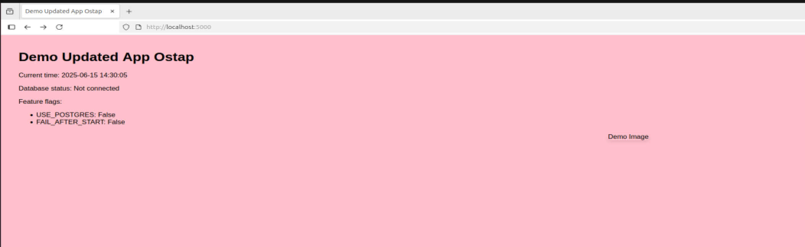
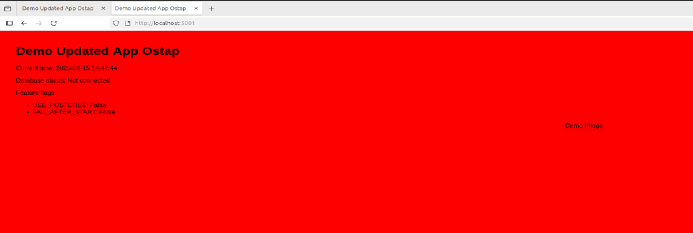

**Завдання**

**1. Підготовка середовища**
   
Встановіть microk8s на обрану платформу
https://microk8s.io/#install-microk8s
```aiignore
➜  k8s git:(main) ✗ microk8s status --wait-ready
microk8s is running
high-availability: no
  datastore master nodes: 127.0.0.1:19001
  datastore standby nodes: none
...
```

Створіть директорію k8s для маніфестів
```aiignore
➜  17-Pazynuyk-Ostap git:(main) ✗ cd k8s
➜  k8s git:(main) ✗ ls -la
total 12
drwxrwxr-x  2 ostap microk8s 4096 Jun 11 14:35 .
drwxrwxr-x 17 ostap ostap    4096 Jun 15 13:13 ..
-rw-rw-r--  1 ostap ostap      54 Jun 15 13:15 demo-ns.yaml
```


**2. Робота з Namespace**

- Створіть маніфест для Namespace
    Створіть файл demo-ns.yaml

У папці k8s створено необхідний файл `demo-ns.yaml` з усіма необхідними налаштуваннями для створення нового простору імен 

- Створіть неймспейс demo - для основного додатку
  - Застосуйте маніфест
```aiignore
    ➜  k8s git:(main) ✗ kubectl apply -f demo-ns.yaml       
    namespace/demo created
```

- Перевірте створений неймспейс
```aiignore
    ➜  k8s git:(main) ✗ kubectl get namespaces
NAME                 STATUS   AGE
container-registry   Active   3d23h
default              Active   4d
demo                 Active   57s
kube-node-lease      Active   4d
kube-public          Active   4d
kube-system          Active   4d
```


- Труднощі/питання при вирішенні задач 1 та 2.
  - Зацікавило чому під час курсу для ямл файлів завжди використовується закінчення `.yaml` якщо з мого особистого досвіду розробники завжди використовують закінчення `.yml` для опису файлів даного типу. 
    - Відповідь: різниці по розмітці чи типу читання ций файлів немає, все залежить від стандартів спільноти з якої ви прийшли, розширення `.yml` більш поширене та звиченя для спільноти розробників, `.yaml` більш нове та "правильне" з точки зору devops спільноти.
  - Отримав помилку `➜  k8s git:(main) ✗ kubectl apply -f demo-ns.yaml error: error validating "demo-ns.yaml": error validating data: failed to download openapi: Get "http://localhost:8080/openapi/v2?timeout=32s": dial tcp 127.0.0.1:8080: connect: connection refused; if you choose to ignore these errors, turn validation off with --validate=false`
    - Відповідь: Просто скачати `microk8s` та `kubectl` не достатньо для того, щоб могти працювати з ними, також необхідно налаштувати в `kubectl` що конкретно в нашій ситуації ми використовуємо локальний кластер microk8s для роботи (в робочих проєктах скоріш за все буде використовуватись кластери AWS, GCP, etc)

**3. Робота з Pod**
   
- Створіть маніфест для Pod
  - Створіть файл demo-pod.yaml
  - Налаштуйте Pod з нашим додатком:
    - Використовуйте образ з Docker Hub
    - Вкажіть порт контейнера
    - Розмістіть Pod в неймспейсі demo
    - Встановіть рожевий колір через env параметр
    - Назвіть його pink
    - Застосуйте маніфест

- Перевірте створений Pod

- Перевірте опис Pod
  - Подивіться, які поля зʼявились у metadata
```aiignore
  ➜  k8s git:(main) ✗ kubectl apply -f demo-pod-hw7.yaml
pod/pink created
➜  k8s git:(main) ✗ kubectl get pods -n demo

NAME   READY   STATUS              RESTARTS   AGE
pink   0/1     ContainerCreating   0          12s
➜  k8s git:(main) ✗ kubectl get pods -n demo

NAME   READY   STATUS    RESTARTS   AGE
pink   1/1     Running   0          93s
➜  k8s git:(main) ✗ kubectl describe pod pink -n demo
Name:             pink
Namespace:        demo
Priority:         0
Service Account:  default
Node:             ostap/10.0.2.15
Start Time:       Sun, 15 Jun 2025 14:15:55 +0000
Labels:           app=pink-app
Annotations:      cni.projectcalico.org/containerID: 0c0c32668c3f234881d0c8b32005f8cab077f0cd5c88bd0f061131180068d7f4
                  cni.projectcalico.org/podIP: 10.1.235.94/32
                  cni.projectcalico.org/podIPs: 10.1.235.94/32
Status:           Running
IP:               10.1.235.94
IPs:
  IP:  10.1.235.94
Containers:
  pink-container:
    Container ID:   containerd://2b58b46d21bf97e17cae49c9f8785a195deabfea217e1a8241ce69d393d38d1e
    Image:          opazyniuk/python-app:hw-5
    Image ID:       docker.io/opazyniuk/python-app@sha256:ae100fd35698680ac298b8374f38529bf2ee283844f235060cba91c4aa522071
    Port:           5000/TCP
    Host Port:      0/TCP
    State:          Running
      Started:      Sun, 15 Jun 2025 14:16:08 +0000
    Ready:          True
    Restart Count:  0
    Environment:
      BACKGROUND_COLOR:  #FFC0CB
    Mounts:
      /var/run/secrets/kubernetes.io/serviceaccount from kube-api-access-nblhl (ro)
Conditions:
  Type                        Status
  PodReadyToStartContainers   True 
  Initialized                 True 
  Ready                       True 
  ContainersReady             True 
  PodScheduled                True 
Volumes:
  kube-api-access-nblhl:
    Type:                    Projected (a volume that contains injected data from multiple sources)
    TokenExpirationSeconds:  3607
    ConfigMapName:           kube-root-ca.crt
    Optional:                false
    DownwardAPI:             true
QoS Class:                   BestEffort
Node-Selectors:              <none>
Tolerations:                 node.kubernetes.io/not-ready:NoExecute op=Exists for 300s
                             node.kubernetes.io/unreachable:NoExecute op=Exists for 300s
Events:
  Type    Reason     Age   From               Message
  ----    ------     ----  ----               -------
  Normal  Scheduled  114s  default-scheduler  Successfully assigned demo/pink to ostap
  Normal  Pulling    111s  kubelet            Pulling image "opazyniuk/python-app:hw-5"
  Normal  Pulled     102s  kubelet            Successfully pulled image "opazyniuk/python-app:hw-5" in 8.916s (8.916s including waiting). Image size: 56930913 bytes.
  Normal  Created    102s  kubelet            Created container: pink-container
  Normal  Started    102s  kubelet            Started container pink-container
```

Вдалось запустити pod через створений manifest файл у просторі імен demo.


- Перевірте доступність додатку

  `kubectl port-forward -n demo pink 5000:5000`

  - Відкрийте http://localhost:5000 в браузері
  - Перевірте роботу ендпоінтів:
    - /health/ready
    - /health/live
    - /info
```aiignore
➜  k8s git:(main) ✗ kubectl port-forward -n demo pod/pink 5000:5000

Forwarding from 127.0.0.1:5000 -> 5000
Forwarding from [::1]:5000 -> 5000

Handling connection for 5000
Handling connection for 5000
Handling connection for 5000
Handling connection for 5000
Handling connection for 5000
Handling connection for 5000
Handling connection for 5000
Handling connection for 5000

➜  k8s git:(main) ✗ curl http://127.0.0.1:5000/health/ready                                                                       
{"status":"ready"}
➜  k8s git:(main) ✗ curl http://127.0.0.1:5000/health/live 
{"status":"alive"}
➜  k8s git:(main) ✗ curl http://127.0.0.1:5000/info       
{"app":"demo","features":{"FAIL_AFTER_START":false,"USE_POSTGRES":false},"version":"1.0.0"}
```

Вдалось зробити под доступним через пересилання хост порту 5000 на порт пода де був запущений наш сервіс.


- Створіть Pod без використання маніфеста
  - Налаштуйте Pod з нашим додатком:
    - Використовуйте образ з Docker Hub
    - Вкажіть порт контейнера
    - Розмістіть Pod в неймспейсі demo
    - Встановіть червоний колір через env параметр
    - Назвіть його red
```aiignore
➜  k8s git:(main) ✗ kubectl run red \
  --image=opazyniuk/python-app:hw-5 \
  --port=5000 \
  --env="BACKGROUND_COLOR=#FF0000" \
  --namespace=demo
    pod/red created
    
➜  k8s git:(main) ✗ kubectl get pods -n demo                      
NAME   READY   STATUS    RESTARTS   AGE
pink   1/1     Running   1          34m
red    1/1     Running   0          4m9s
```



**4. Прибирання**
- Видаліть два Podи
- Видаліть Namespace

```aiignore
➜  17-Pazynuyk-Ostap git:(main) ✗ kubectl get pods -n demo          

No resources found in demo namespace.
➜  17-Pazynuyk-Ostap git:(main) ✗ kubectl delete namespace demo
namespace "demo" deleted
➜  17-Pazynuyk-Ostap git:(main) ✗ kubectl get namespaces

NAME                 STATUS   AGE
container-registry   Active   4d1h
default              Active   4d1h
kube-node-lease      Active   4d1h
kube-public          Active   4d1h
kube-system          Active   4d1h
```

Вдалось видалити створені поди та простір імен demo.
