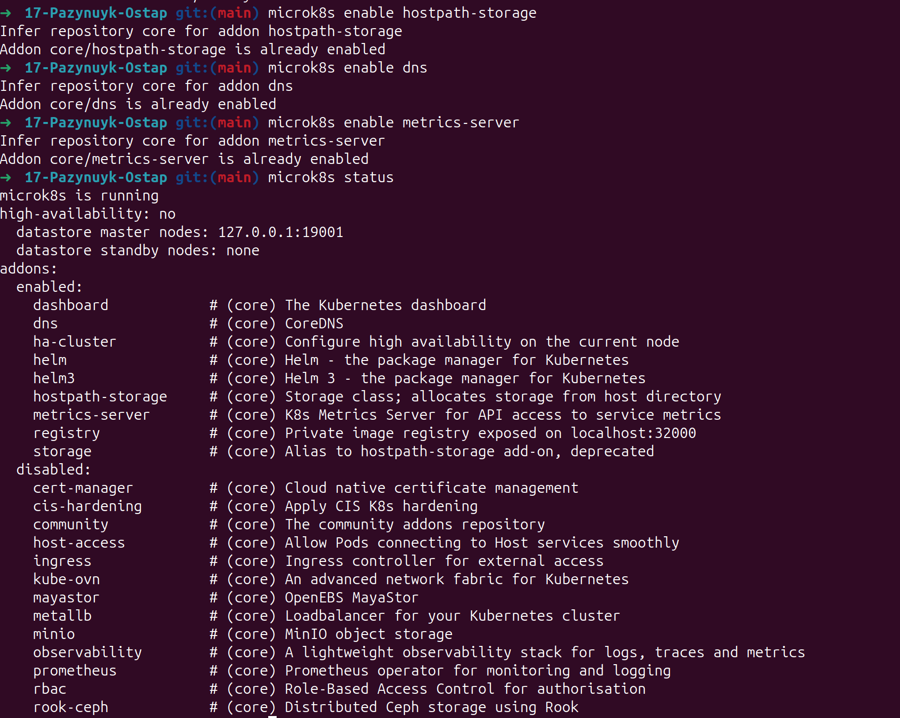
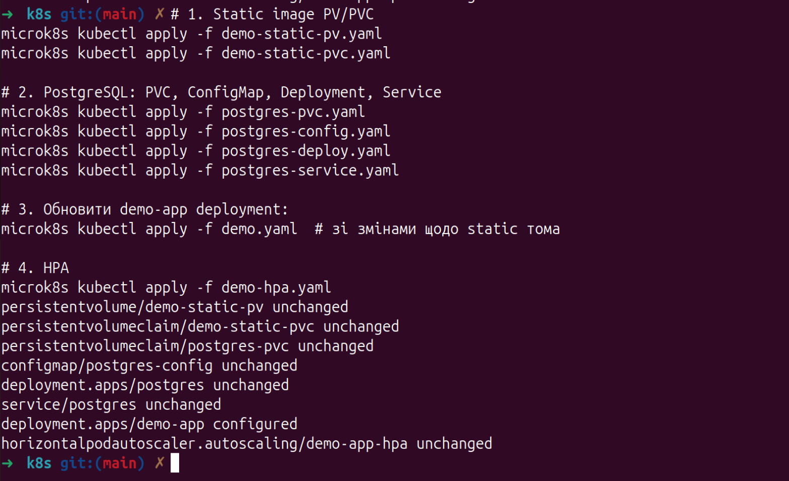
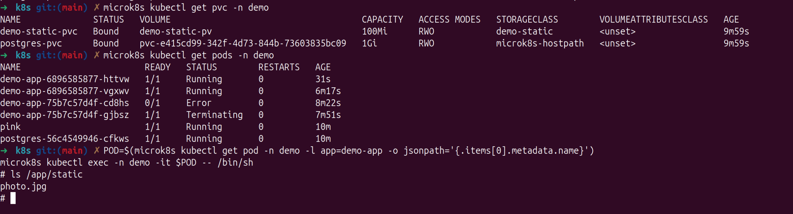
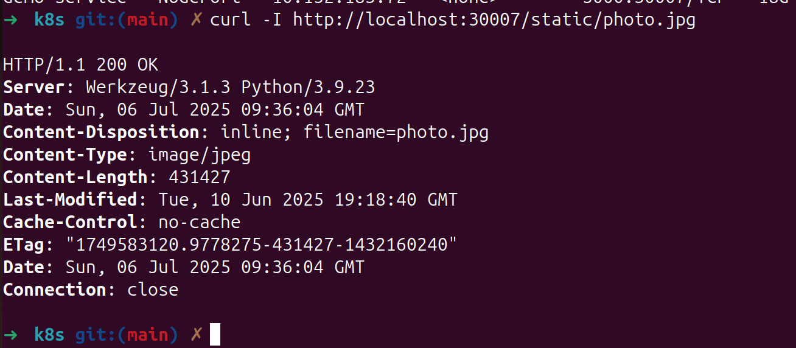
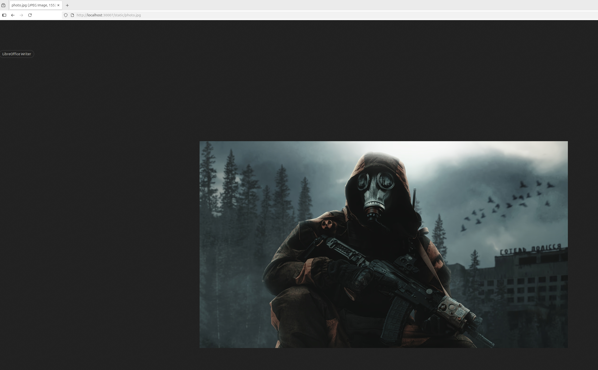
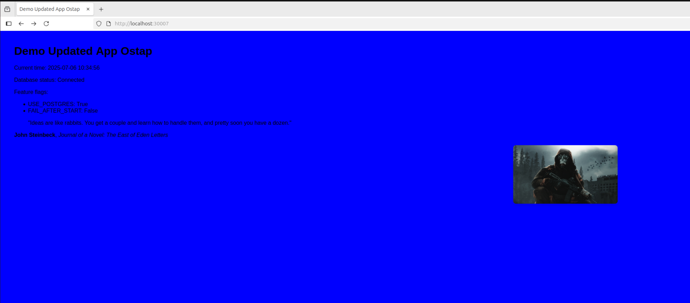

### 1. Увімкнення модулів MicroK8s

```bash
microk8s enable hostpath-storage
microk8s enable dns
microk8s enable metrics-server
```
Результат:
✅ Успішно активовано всі модулі (перевірено через microk8s status)


### 2. Створення PVC для PostgreSQL
Файл: postgres-pvc.yaml

```yaml
apiVersion: v1
kind: PersistentVolumeClaim
metadata:
  name: postgres-pvc
  namespace: demo
spec:
  accessModes:
    - ReadWriteOnce
  resources:
    requests:
      storage: 1Gi
  storageClassName: microk8s-hostpath
```
Результат:
PVC postgres-pvc створено і змонтовано у контейнер PostgreSQL.



### 3. Створення PV для demo-застосунку
Файли:
demo-static-pv.yaml
demo-static-pvc.yaml

Тип: hostPath, політика: Retain

Результат:
Картинка photo.jpg доступна через /static/photo.jpg





### 4. Деплой PostgreSQL
Компоненти:
postgres-deploy.yaml

- PVC: postgres-pvc
- Volume з init.sql: /docker-entrypoint-initdb.d/init.sql
- ConfigMap: postgres-config.yaml
- Service: postgres-service.yaml

```yaml
volumeMounts:
  - name: postgres-storage
    mountPath: /var/lib/postgresql/data
  - name: postgres-storage
    mountPath: /docker-entrypoint-initdb.d
```
Проблеми:

init.sql не запускався, бо PVC вже містив дані.

init.sql потрапляв у неправильний каталог (/var/lib/postgresql/data), а не у порожній initdb-контекст.

Рішення:
```bash
kubectl delete deployment postgres -n demo
kubectl delete pvc postgres-pvc -n demo
kubectl delete pv <pv-name>
sudo rm -rf postgres-data/*
cp db/init.sql postgres-data/
```
Результат:
Після очищення PVC — quotes створено, БД працює.

```aiignore
➜  k8s git:(main) ✗ ls -l /home/ostap/devops_course/17-Pazynuyk-Ostap/postgres-data/

total 4
-rw-rw-r-- 1 ostap ostap 1847 Jul  6 10:32 init.sql
➜  k8s git:(main) ✗ microk8s kubectl apply -f postgres-pvc.yaml
microk8s kubectl apply -f postgres-deploy.yaml

persistentvolumeclaim/postgres-pvc created
deployment.apps/postgres created
➜  k8s git:(main) ✗ POD=$(microk8s kubectl get pod -n demo -l app=postgres -o jsonpath='{.items[0].metadata.name}')
microk8s kubectl exec -n demo -it $POD -- psql -U user -d demo -c '\dt'

        List of relations
 Schema |  Name  | Type  | Owner 
--------+--------+-------+-------
 public | quotes | table | user
(1 row)

```

### 5. Деплой demo-застосунку
Компоненти:

Deployment demo-deploy.yaml

ConfigMap app-config.yaml з параметрами:
- USE_POSTGRES=true
- POSTGRES_HOST=postgres
- POSTGRES_DB=demo
- POSTGRES_USER=user
- POSTGRES_PASSWORD=password
- BACKGROUND_COLOR=#0000ff



### Проблеми:

Дані з ConfigMap не застосовувалися.

Рішення:

```bash
kubectl apply -f demo-cm.yaml
kubectl rollout restart deployment demo-app -n demo
```
Результат:

App працює, колір змінено на синій, з'єднання з БД успішне.

### 6. Налаштування HPA
Файл: demo-hpa.yaml

```yaml
apiVersion: autoscaling/v2
kind: HorizontalPodAutoscaler
metadata:
  name: demo-app-hpa
  namespace: demo
spec:
  scaleTargetRef:
    apiVersion: apps/v1
    kind: Deployment
    name: demo-app
  minReplicas: 2
  maxReplicas: 5
  metrics:
    - type: Resource
      resource:
        name: cpu
        target:
          type: Utilization
          averageUtilization: 50
```

Перевірка:

```bash
kubectl get hpa -n demo -w
```
✅ HPA реагує на навантаження (наприклад, через stress в pod'і)

### 7. Перевірка повної роботи

| Компонент          | Стан | Примітки                                 |
|--------------------|:----:|-------------------------------------------|
| PostgreSQL PVC     | ✅   | Дані зберігаються між рестартами         |
| Статична картинка  | ✅   | `/static/photo.jpg`, працює через service |
| З'єднання з БД     | ✅   | Дані зчитуються з таблиці `quotes`        |
| HPA                | ✅   | Масштабує `demo-app` при навантаженні     |


### 🐞 Проблеми і їх вирішення
| **Проблема**                                      | **Рішення**                                                                 |
|--------------------------------------------------|------------------------------------------------------------------------------|
| `init.sql` не спрацював після першого запуску     | Очистити PVC/PV, перескопіювати файл у init volume                          |
| Дані з `ConfigMap` не потрапляли в `env`          | Rollout перезапуск deployment після `apply`                                 |
| Поди не бачили змін у конфігах                    | Використано `kubectl rollout restart`                                       |
| PostgreSQL не бачив `init.sql`                    | Файл не потрапив у `/docker-entrypoint-initdb.d` через неправильний `mount` |
| Старі `PV` заважали ініціалізації                 | Видалено вручну через `kubectl delete pv` + `rm -rf`                        |

📝 Висновок
Усі пункти завдання виконано. Створено повноцінну інфраструктуру для demo-сервісу з підключенням до PostgreSQL, сервінгом статики та автоматичним масштабуванням через HPA. Всі компоненти взаємодіють у namespace: demo, а збереження даних забезпечується через PVC.