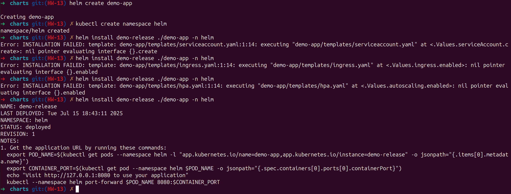
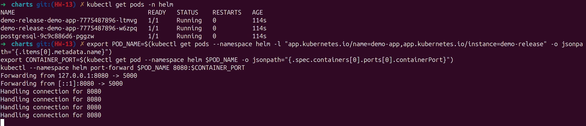
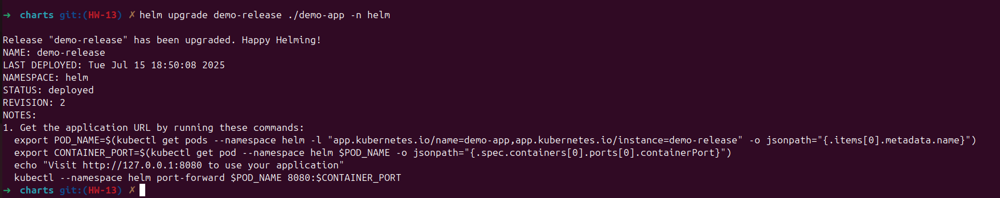
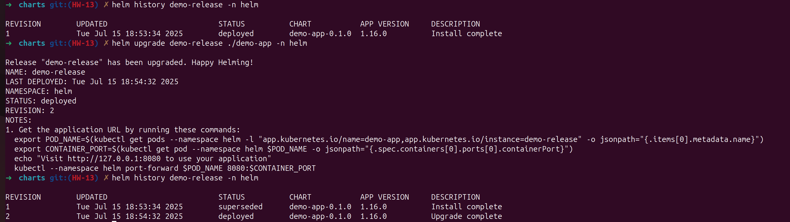
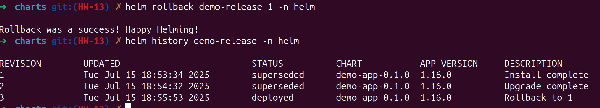
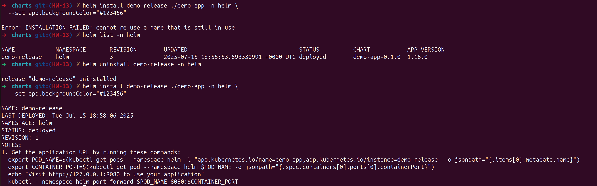

# Робота з Helm у Kubernetes

## Ціль

Освоїти базові операції з Helm: створення Helm chartів, конфігурація deploymentів, додавання PostgreSQL, оновлення та відкат релізів.

---

## Етап 1: Встановлення Helm

```bash
microk8s enable helm
alias helm='microk8s.helm'
helm version
```

> Після додавання alias команда `helm` доступна напряму.

---

## Етап 2: Створення Helm Chart

```bash
mkdir charts && cd charts
helm create demo-app
```

> Створюється структура з шаблонами YAML, Chart.yaml, values.yaml тощо.

---

## Етап 3: Конфігурація `values.yaml`

```yaml
replicaCount: 2
image:
  repository: opazyniuk/python-app
  tag: hw-7
  pullPolicy: IfNotPresent
app:
  backgroundColor: "#00ff00"
```

> У шаблоні deployment.yaml підставляються ці значення.

---

## Етап 4: Додавання PostgreSQL

### values.yaml

```yaml
postgres:
  image: postgres:14
  db: demo_db
  user: demo_user
  password: securepass
  storage: 1Gi
```

### Secret

```yaml
apiVersion: v1
kind: Secret
metadata:
  name: postgres-secret
type: Opaque
data:
  username: {{ .Values.postgres.user | b64enc }}
  password: {{ .Values.postgres.password | b64enc }}
```

### PVC

```yaml
apiVersion: v1
kind: PersistentVolumeClaim
metadata:
  name: postgres-pvc
spec:
  accessModes: ["ReadWriteOnce"]
  resources:
    requests:
      storage: {{ .Values.postgres.storage }}
```

---

## Етап 5: Деплой Helm Chart

```bash
kubectl create namespace helm
helm install demo-release ./demo-app -n helm
kubectl get all -n helm
```

> Якщо виникають помилки типу `nil pointer`, додайте в `values.yaml` порожні секції: `ingress`, `autoscaling`, `serviceAccount`.

---

## Етап 6: Оновлення Helm релізу

```bash
helm upgrade demo-release ./demo-app -n helm \
  --set app.backgroundColor="#123456"
```

> Також можна оновлювати через редагування `values.yaml`.

---

## Етап 7: Видалення релізу

```bash
helm uninstall demo-release -n helm
```

---

## Етап 8: Rollback

1. Перевірити історію:

```bash
helm history demo-release -n helm
```

2. Зробити відкaт:

```bash
helm rollback demo-release 1 -n helm
```

---

## Етап 9: Порт-форвардинг (перевірка застосунку)

```bash
export POD_NAME=$(kubectl get pods -n helm -l "app.kubernetes.io/name=demo-app,app.kubernetes.io/instance=demo-release" -o jsonpath="{.items[0].metadata.name}")
export CONTAINER_PORT=$(kubectl get pod -n helm $POD_NAME -o jsonpath="{.spec.containers[0].ports[0].containerPort}")
kubectl port-forward -n helm $POD_NAME 8080:$CONTAINER_PORT
```

> Перевірка: [http://127.0.0.1:8080](http://127.0.0.1:8080)

---

## Підсумок

| Етап                     | Статус |
| ------------------------ | ------ |
| Helm встановлено         | ✅      |
| Chart створено           | ✅      |
| PostgreSQL додано        | ✅      |
| Реліз деплоєно           | ✅      |
| Upgrade/Ролбек проведено | ✅      |







